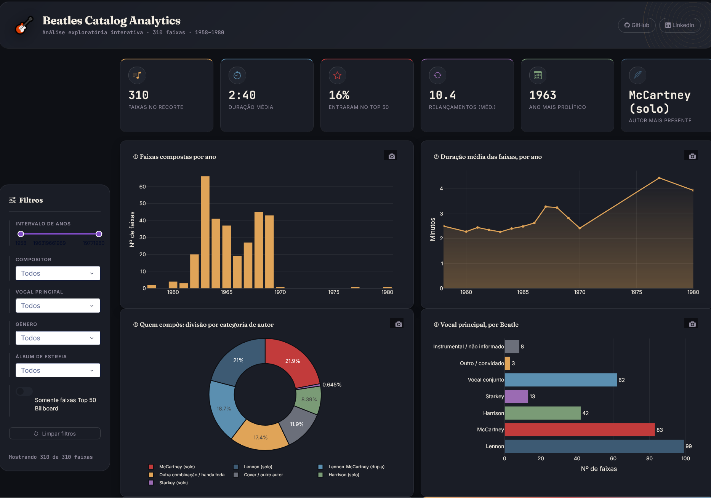
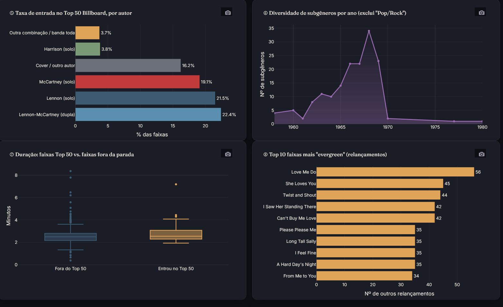
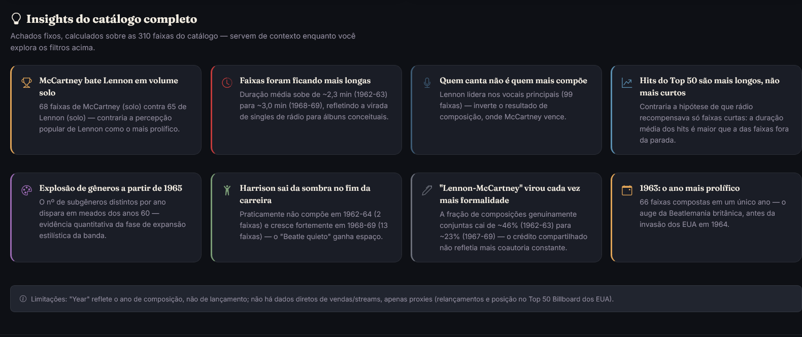

# 🎸 Beatles Catalog Analytics — Dashboard 

Dashboard interativo construído com **Dash + Plotly**, a partir da EDA original do catálogo dos Beatles (310 faixas, 1958–1980). Transforma os 10 gráficos estáticos do notebook em uma ferramenta exploratória: filtros cruzados, estatísticas dinâmicas e 8 gráficos que reagem em tempo real.





## Como rodar

```bash
pip install -r requirements.txt
python app.py
```
## O que tem:

**Filtros (sidebar)**
- Intervalo de anos (1958–1980)
- Compositor (Lennon solo, McCartney solo, Harrison solo, Starkey solo, dupla Lennon-McCartney, cover, etc.)
- Vocal principal
- Gênero musical
- Álbum de estreia
- Toggle "somente faixas Top 50 Billboard"
- Botão "Limpar filtros"

**Estatísticas (KPIs, recalculadas a cada filtro)**
- Nº de faixas no recorte
- Duração média
- % que entrou no Top 50 Billboard
- Média de relançamentos
- Ano mais prolífico do recorte
- Autor mais presente no recorte

**8 gráficos interativos**
1. Faixas compostas por ano
2. Duração média por ano
3. Divisão por categoria de compositor (donut)
4. Vocal principal por Beatle
5. Taxa de entrada no Top 50 Billboard, por autor
6. Diversidade de subgêneros por ano
7. Duração: faixas Top 50 vs. fora da parada (boxplot)
8. Top 10 faixas mais "evergreen" (relançamentos)

**Insights fixos**: 8 achados do catálogo completo, com contexto, servindo de "storytelling" fixo enquanto os gráficos acima reagem aos filtros.

## Estrutura

```
beatles-dashboard/
├── app.py              # aplicação Dash completa
├── data/
│   └── beatles_songs.csv
├── assets/
│   └── style.css        # tema dark customizado (Dash carrega automaticamente)
├── requirements.txt
└── README.md
```

## Notas técnicas

- Classificação de compositor e vocal segue a mesma lógica de regras do notebook original (`beatles_eda.ipynb`), reaplicada em `app.py`.
- Gêneros passam por uma limpeza leve (capitalização, artefatos de raspagem tipo `"Acid Rock["`) antes de virar opção de filtro.
- Um único callback recalcula KPIs + 8 figuras a partir do dataframe filtrado — evita filtrar os dados 8 vezes.
- Tema dark com a mesma paleta de cores dos PNGs originais (navy, vermelho, verde, roxo, dourado) para manter identidade visual entre o notebook e o dashboard.

## Stack

Python · Dash · Plotly · dash-bootstrap-components · pandas

---
*Projeto de portfólio — parte da preparação para vaga de estágio em Dados.*
